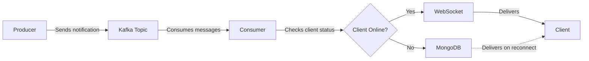

# Kafka Notification Service

This project demonstrates a Kafka-based notification service with WebSocket integration. It includes a producer for sending notifications and a consumer for delivering them to connected WebSocket clients.

# System Flow



### Flow Description

1. **Producer**

   - Generates notifications with unique IDs
   - Sends notifications to Kafka topic 'notifications'

2. **Consumer**

   - Listens to Kafka topic continuously
   - Manages WebSocket connections
   - Handles notification delivery logic

3. **Delivery Flow**
   - If client is online: Sends directly via WebSocket
   - If client is offline: Stores in MongoDB
   - On client reconnection: Delivers pending notifications

## Prerequisites

- Node.js
- Kafka
- MongoDB

## Setup

1. Clone the repository:

   ```sh
   git clone <repository-url>
   cd kafka
   ```

2. Install dependencies:

   ```sh
   npm install
   ```

3. Configure Kafka and MongoDB:
   - Update the Kafka broker address in `producer.js` and `consumer.js`.
   - Update the MongoDB connection string in `consumer.js`.

## Running the Service

1. Start the Kafka broker and create the `notifications` topic.

2. Start the Kafka producer:

   ```sh
   node producer.js
   ```

3. Start the Kafka consumer and WebSocket server:

   ```sh
   node consumer.js
   ```

4. Open the `test.html` file in a web browser to connect to the WebSocket server and receive notifications.

## Usage

- The producer sends notifications to the Kafka topic.
- The consumer listens for notifications and delivers them to connected WebSocket clients.
- If a client is offline, notifications are saved in MongoDB and delivered when the client reconnects.

## Example Notification

```json
{
  "id": "notif-001",
  "userId": "user1",
  "message": "This is a test notification",
  "timestamp": "2023-10-01T12:00:00Z"
}
```

### Docker Setup

1. Build and run using Docker Compose:

```sh
docker-compose up --build
```

2. Or using Docker directly:

```sh
# Build the image
docker build -t kafka-notification-service .

# Run the container
docker run -p 8083:8083 kafka-notification-service
```

# kafka

# Create a topic

docker exec kafka kafka-topics --create --topic test-topic --bootstrap-server localhost:9092 --replication-factor 1 --partitions 1

# Produce a message

docker exec -it kafka kafka-console-producer --topic test-topic --bootstrap-server localhost:9092

# In a separate terminal, consume messages

docker exec -it kafka kafka-console-consumer --topic test-topic --from-beginning --bootstrap-server localhost:9092

## Acknowledgements

- [KafkaJS](https://kafka.js.org/)
- [ws](https://github.com/websockets/ws)
- [Mongoose](https://mongoosejs.com/)
